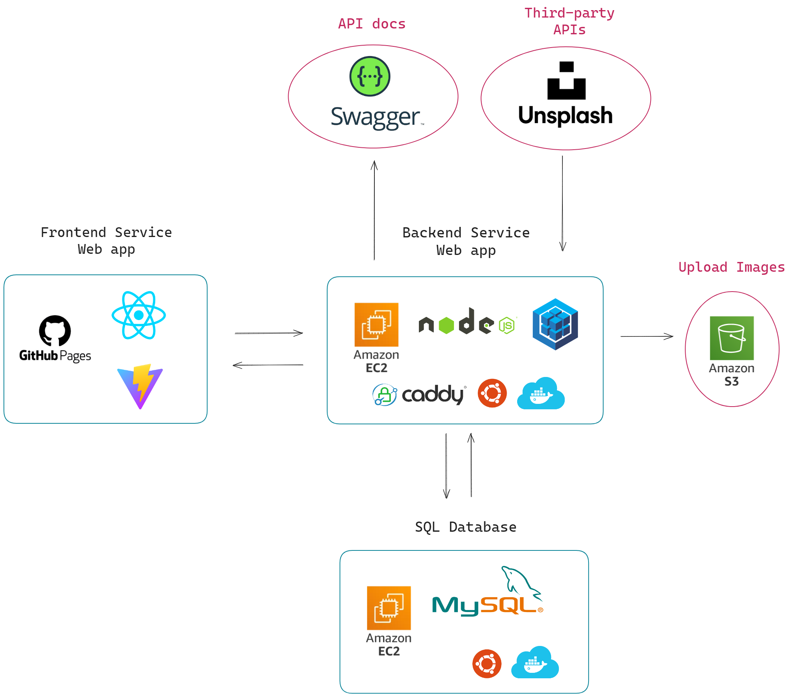
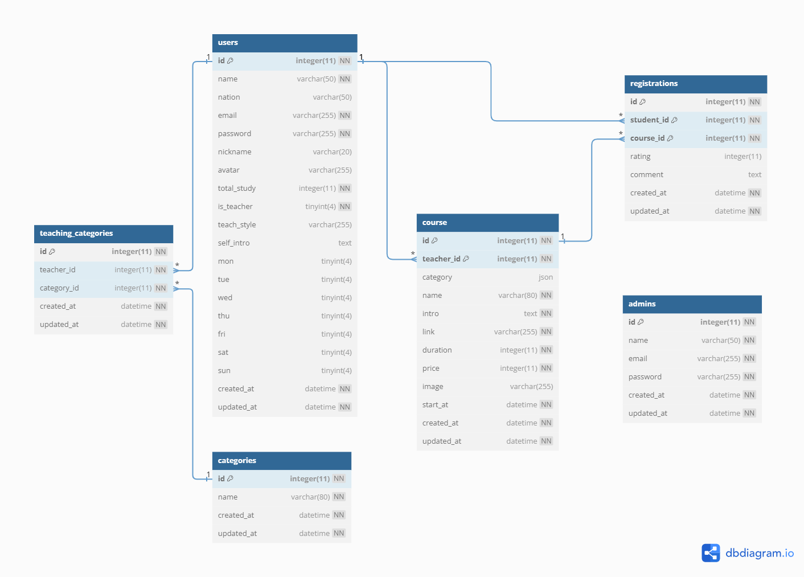
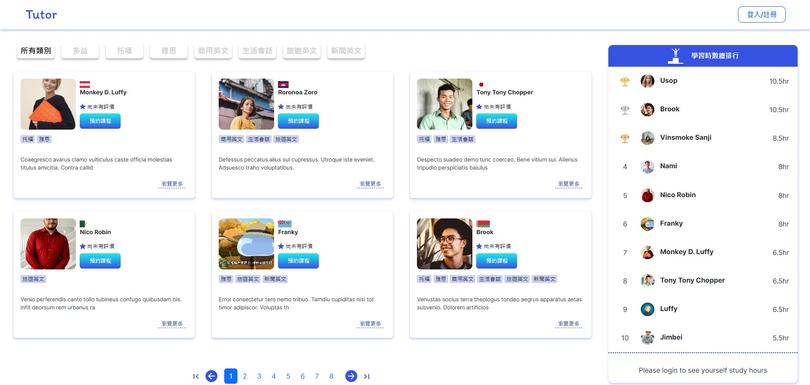
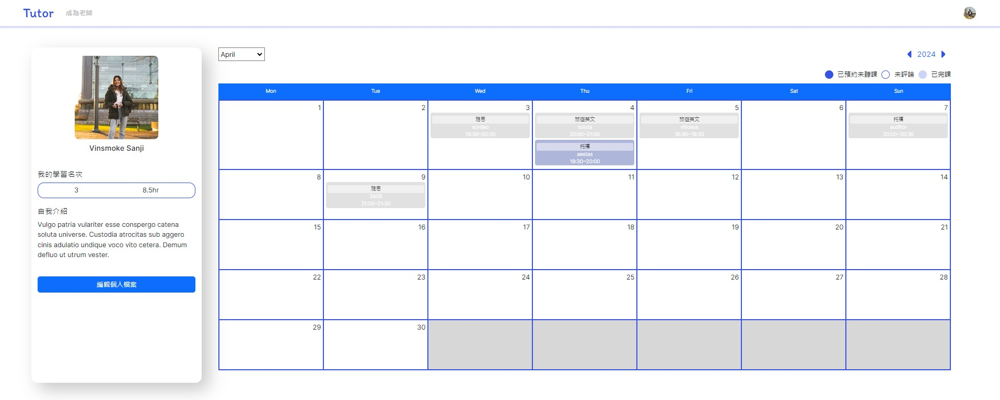
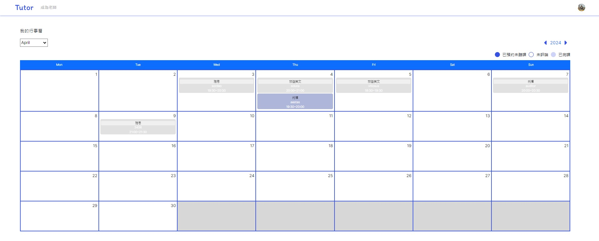
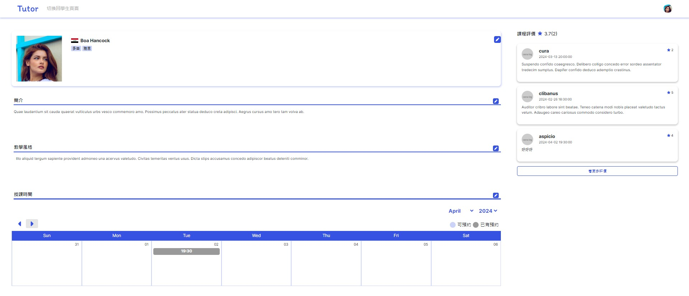

# 

Tutor 是一個可以提供使用者選擇家教的教學平台

網頁(前端): https://yuri1022.github.io/Tutor/

Swagger API 文件: https://ec2-13-231-143-123.ap-northeast-1.compute.amazonaws.com/docs/

以下是由後端架構網頁開發(應用程式)的功能簡介

## 產品功能(Features)

### 1. 首頁
   - 未登入的使用者可以瀏覽首頁，查看學生的學習時數排行，以及家教老師清單
   - 此外使用者也可依照教學類別，或使用關鍵字查詢，來選擇合適的家教老師
   - 當使用者完成登入，可進一步查看完整老師資訊以及預約課程的服務
   
### 2. 一般使用者(學生用戶)
   - 當使用者於平台完成註冊，即享有學生身分
   - 進入首頁，點擊家教老師的`瀏覽更多`按鈕可以瀏覽家教老師的個人資料
   - 進入首頁，點擊`預約課程`按鈕將呈現當週老師開設課程時端，供學生挑選並進行課程預約
   - 點擊右上方頭像，進入`個人檔案`，使用者可以編輯`姓名`、`大頭照`、`自我介紹`
   - 點擊右上方頭像，進入`我的課程`，可查看所有完成預約的課程行事曆，並對已完成的課程可進行評分及評論
   - 若預約課程的時間在今天以後，可以`取消預約`

### 3. 申請成為老師(老師用戶)
   - 使用者登入後，預設為學生身分，點擊`成為老師`按鈕，填寫表單，即具老師身分
   - 點擊右上方頭像，進入`個人檔案`，點擊`授課時間`右方的`鉛筆圖示`，周曆下方會顯示`+`，開始進行新增課程
   - 點擊右上方頭像，進入`我的課程`，可以瀏覽老師的`課程行事曆`，會依照時間顯示所有開設的課程，確定自己開設的課程是否有學生預約
   - 老師可以切換為學生身分，即可預約課程

### 4. 後台：
   - 只有管理者可以瀏覽後台，查看`使用者清單`

## 測試帳號

### 1. 學生：
   - 帳號：user1@example.com
   - 密碼：12345678
  
### 2. 老師：
   - 帳號：teacher1@example.com
   - 密碼：12345678
  
### 3. 管理員：
   - 帳號：root@example.com
   - 密碼：12345678

## 後端

### 系統架構

### 資料庫架構(ERD)

## 專案畫面

### 首頁

### 以學生身分瀏覽我的檔案

### 以學生身分瀏覽我的課程

### 以老師身分瀏覽我的檔案

### 以老師身分瀏覽我的課程

### Dependencies
- @aws-sdk/client-s3: "^3.556.0"
- @faker-js/faker: "^8.4.1"
- axios: "^1.6.8"
- bcryptjs: "^2.4.3""
- cors: "^2.8.5""
- dayjs: "^1.11.10"
- dotenv: "^16.4.5"
- express: "^4.19.2"
- multer: "^1.4.5-lts.1"
- mysql2: "^3.9.5"
- passport: "^0.7.0"
- passport-facebook: "^3.0.0"
- passport-google-oauth20: "^2.0.0"
- passport-jwt: "^4.0.1"
- reflect-metadata: "^0.2.2"
- sequelize: "^6.37.3"
- sequelize-cli: "^6.6.2"
- sequelize-typescript: "^2.1.6"
- swagger-ui-express: "^5.0.0"
- unsplash-js: "^7.0.19"

### Team

 - Front-end - [Elaine](https://github.com/yuri1022)
 - Front-end - [Kai](https://github.com/enternalsong) 
 - Back-end - [Chris](https://github.com/yuan6636)
 - Back-end - [Tommy](https://github.com/Tommy0901)
 - UI/UX - 北極 - [北極](https://github.com/judy-code)